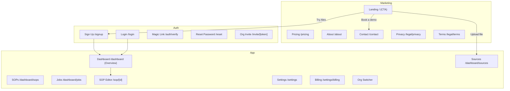

## Alex — Site Map (Marketing, Auth, App)

### Visual map

### Pages and purpose
- Landing `/`
  - Hero with value prop, video, trust logos
  - Primary CTA: “Try Alex” → `/signup`
  - Secondary CTAs: “Upload a file” → `/dashboard` (gated), “Book a demo” → `/contact`
- Pricing `/pricing`: tiers (Starter/Team/Business), feature matrix, FAQs, CTA to `/signup`
- About `/about`: mission, team, careers link
- Contact `/contact`: demo form (email+message), support links
- Legal `/legal/{privacy|terms}`

Auth
- Login `/login`: email+password or OAuth; magic link option
- Sign Up `/signup`: email+password or OAuth, org name
- Magic Link `/auth/verify`: completes email login
- Reset `/reset`: request + set-new
- Invite `/invite/[token]`: accept org invite

App
- Dashboard `/dashboard`: Overview with stat cards, deltas, sparklines, Recent SOPs, jobs widget
- SOPs `/dashboard/sops`: list with filters, tags, owners; create/Import actions
- Sources `/dashboard/sources`: recent uploads, statuses
- Jobs `/dashboard/jobs`: live progress (SSE), history
- SOP Editor `/sop/[id]`: edit/preview, versions, chat, export (MD/PDF/DOCX)
- Settings `/settings`: profile, notifications; `/settings/billing`: plan, invoices
- Org switcher: switch current organization

### Navigation & CTAs
- Header (marketing): Pricing, About, Login, primary CTA “Try Alex” (sign up)
- Header (app): New SOP, Upload, Record, Create from prompt, Import
- Footer: Legal links, email, social

